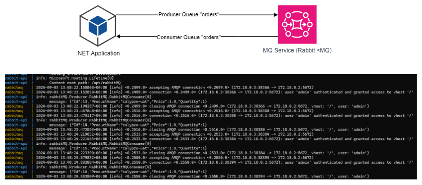

# .NET Standard (.NET 8) and RabbitMQ



This application start with port 8080.

### Build application
```sh
$ dotnet build
```

### Start application
```sh
$ dotnet run --project rabbitMQ
```

### Publish Release
```sh
$ dotnet publish -c Release
```